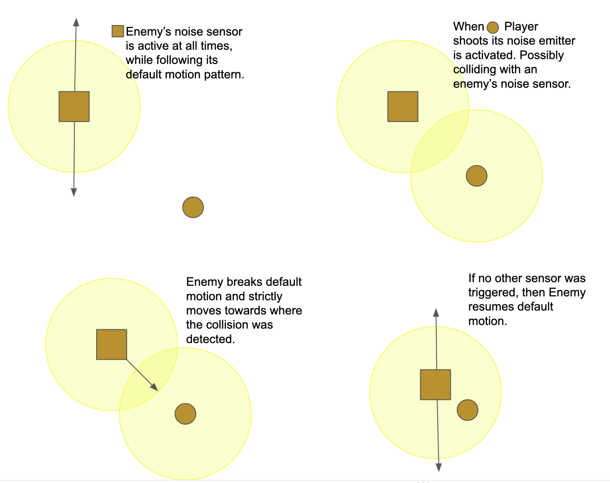
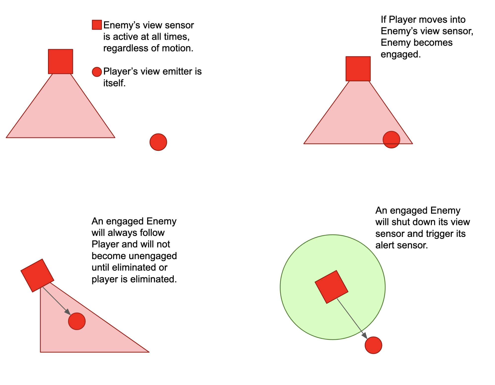
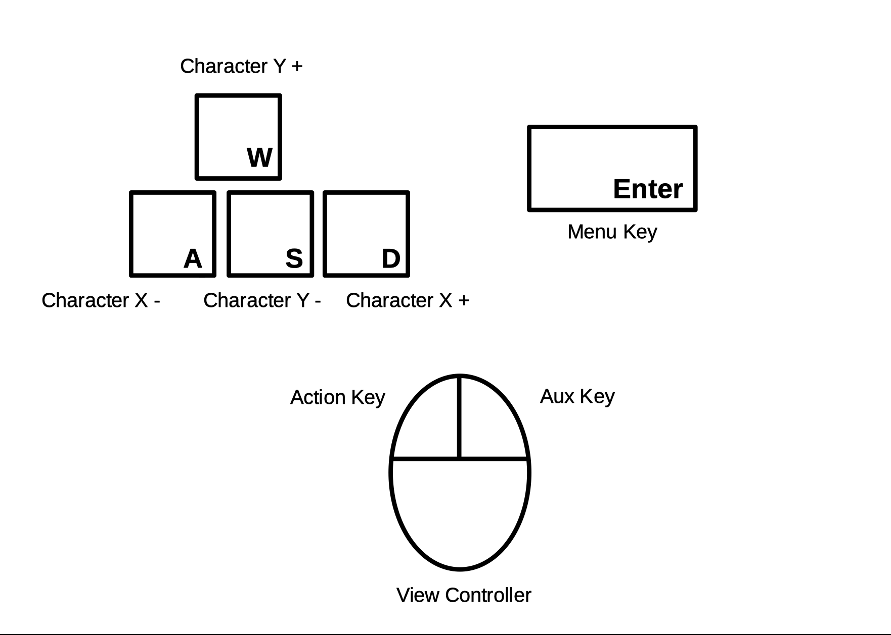
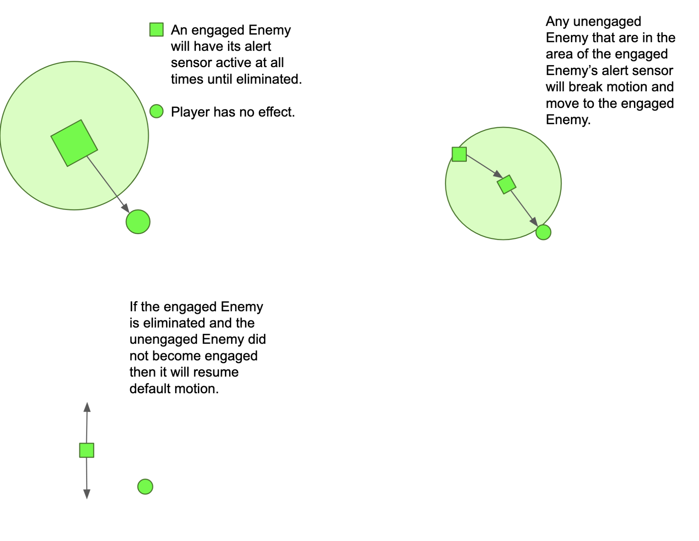
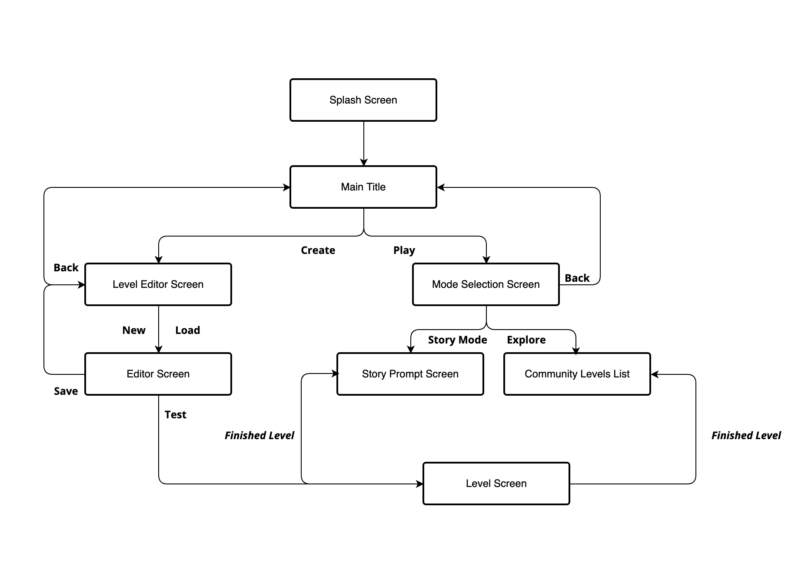

# Shhhoutout

## _Game Design Document_

<!-- Output copied to clipboard! -->

<!-----

You have some errors, warnings, or alerts. If you are using reckless mode, turn it off to see inline alerts.
* ERRORs: 0
* WARNINGs: 0
* ALERTS: 5

Conversion time: 1.452 seconds.

Using this Markdown file:

1. Paste this output into your source file.
2. See the notes and action items below regarding this conversion run.
3. Check the rendered output (headings, lists, code blocks, tables) for proper
   formatting and use a linkchecker before you publish this page.

Conversion notes:

* Docs to Markdown version 1.0β33
* Wed May 04 2022 21:20:14 GMT-0700 (PDT)
* Source doc: Game Design Document
* This document has images: check for >>>>>  gd2md-html alert:  inline image link in generated source and store images to your server. NOTE: Images in exported zip file from Google Docs may not appear in  the same order as they do in your doc. Please check the images!

----->
# 
    **Index**

[TOC]

1. **Game design **
1. _Summary_

After committing a heroic act of whistleblowing a black operation mission, your goal is not to escape with the information from the dangers of being discovered. 

Everyone is out to get you, so you can trust no one but yourself. You can’t be heard or seen by anyone or you risk not making it out safely.

Watch your step, your surroundings and yourself to make sure that the world knows who’s behind these macabre missions and take the entire operation down from the inside.

2. _Gameplay_

Your goal is to reach the final destination as covertly as possible.  \
 \
During your exploring of the map you may encounter different keys and objects that can assist you in completing your mission. These objects may include healing packs, ammunition or new weapons. 

You will most definitely encounter enemies patrolling the area who will without hesitation come out to get you. If you’re close enough, shooting at something or someone may alert the enemy and they may try to locate you. \
 \
If you were located, brace yourself for combat - as you will have to eliminate the enemy before it eliminates you or calls for nearby backup.

A good clean sweep of the area means eliminating all the enemies without ever being detected - you will be graded by your Captain as to how well you did.

3. _Mindset_

 

The mindset that the player will hopefully engage in will vary throughout gameplay.

In the beginning, through storytelling, it is hoped that the player obtains a sense of heroism and imminent danger.

Throughout gameplay, the player will obtain a sense of carefulness, awareness and healthy worryness as they traverse the level.

If engaged in combat, the player will obtain a sense of adrenaline and acceleration as they rush to eliminate the enemy before others are made aware.

If successful, the player will obtain a sense of completion and closure through storytelling. Else, the player will obtain a sense of inspiration to retry the level.

The player will also be able to experience an explorative / creative mindset through level creation, a sense of community will emerge through rating of user curated levels.

2. **Technical**
1. _Screens_

>>>>>  gd2md-html alert: inline image link here (to images/image1.png). Store image on your image server and adjust path/filename/extension if necessary.  (<a href="#">Back to top</a>)(<a href="#gdcalert2">Next alert</a>) >>>>> 

    1.  _Splash Screen_ - The first screen shown to the player as the game is executed, here we can showcase credits or other development information. Step to the next screen is automatic and time-based.

    2. _Main Title_ - The screen after the game has loaded. User input here is limited to selecting the next option: Create, Play, or Quit.

    	a) _Level Editor Screen_ - The screen where the level editor gameplay was selected. Here user input is limited to selecting whether to create a new level file or load an existing one.

    		 \
		i)  _Editor Screen_ - The actual level editor where the user can create and design their own levels. User input is used to place objects, design map and iterate the level.

    	b) _Mode Selection Screen_ - The screen where the play gameplay was selected. Here user input is limited to selecting whether to instantiate a specific level, or random community levels through story mode.

    		i) _Story Prompt Screen _- The screen where the storytelling occurs before a level. Here user input is limited to selecting the next dialog until the level loads. This screen is looped for every level queried, until all levels are finished.

    		ii) _Community Levels Screen _- The screen where the list of community published levels are shown. Here user input is limited to selecting the level to instantiate.

    3. _Level Screen_ - The screen where actual gameplay of a level is displayed. Here user input is limited to game controls within game mechanic context.

2. _Controls_

Game controls are restricted to keyboard and mouse controls. The game will use the well-known WASD mapping to move the character throughout the map.

The mouse (or equivalent) will be used for action control. The player’s target or view will be towards the direction of the mouse pointer - meaning the mouse movement will determine view. 

The right-click will be the action control key - the user will shoot, or interact with objects in the game landscape.

The carriage return key will be used as a menu control key - through which the user can pause, save or quit the game.

Tentatively, the left-click will be an auxiliary control key - leaving open for any further necessity that may arise in development.

>>>>>  gd2md-html alert: inline image link here (to images/image2.png). Store image on your image server and adjust path/filename/extension if necessary.  (<a href="#">Back to top</a>)(<a href="#gdcalert3">Next alert</a>) >>>>> 

3. _Mechanics_

A player’s target is to successfully vacate the level through its exit without being terminated or caught. 

Player Mechanics

The player can roam the level freely in any direction without any limitation to movement or speed - the only limitation is unroutable terrain: walls, locked doors, enemies, or out-of-scope terrain.

The player is equipped with a weapon that can be switched by another available ingame. This weapon can shoot to eliminate obstacles or enemies. Depending on the weapon’s power it may take more or less ammunition to eliminate an object - it will also generate a louder or quieter noise emitter (radius in which the weapon can be heard by enemies).

The player also has three quantifiable indicators of gameplay.

The HP indicator - a measurement of how much HP the player has left to survive the level.

The Stealth indicator - a measurement of how covert the player has been, decreasing for every triggered enemy and increasing for every eliminated enemy.

The Time indicator - a measurement of how much time the player has left to complete the level.

Enemy Mechanics

The enemies roam the level in a predetermined way - line, circular or patterned motion. Every enemy carries a form of attack (close-combat, or far-combat) that can be used against the enemy when engaged.

The enemies have three distinct sensors that interact with the player.

The noise sensor - an invisible radius that symbolized how much the enemy can hear. If a player’s weapon or motion emits a sound radius that comes in contact with this radius, the enemy will break pattern motion, move to the detected collision and continue motion there.

The sight sensor - a specified-angle, visible to the player, area that symbolizes how much the enemy can see. If a player comes in contact with this área, the enemy will engage in combat with the player.

The alert sensor - an invisible radius that symbolizes how much the enemy can alert other enemies. When the enemy is engaged in combat, any other enemies in this radius will move towards the enemy and possibly engage in combat.

Environment Mechanics

The environment is filled with walls, doors and other obstacles. It is also filled with chests and other interactable objects that the player may benefit from. It may also have dimmer or lighter areas that may increase or decrease the player’s and enemies’ sensors.

Sensor Interacting Mechanics

>>>>>  gd2md-html alert: inline image link here (to images/image3.png). Store image on your image server and adjust path/filename/extension if necessary.  (<a href="#">Back to top</a>)(<a href="#gdcalert4">Next alert</a>) >>>>> 

>>>>>  gd2md-html alert: inline image link here (to images/image4.png). Store image on your image server and adjust path/filename/extension if necessary.  (<a href="#">Back to top</a>)(<a href="#gdcalert5">Next alert</a>) >>>>> 

>>>>>  gd2md-html alert: inline image link here (to images/image5.png). Store image on your image server and adjust path/filename/extension if necessary.  (<a href="#">Back to top</a>)(<a href="#gdcalert6">Next alert</a>) >>>>> 

3. **Level Design **
1. Themes
1. Secret Base
    1. Objects
        1. Tanks
        2. Wood boxes
        3. Walls
        4. Doors
    2. Interactive
        5. Guns
        6. Health Packs
        7. Ammunition
2. Level editor
    3. Characters
        8. Player
        9. Enemies
    4. Objects
        10. Predefined rooms
        11. Guns
        12. Keys
        13. Environmental objects
2. Game Flow
1. User starts the level editor
2. User has a variety of preset rooms to select
3. User places rooms in the order he desires
4. The user places the start and goal position in the grid
5. The user clicks play and tests the level
6. The user beats the level thus unlocking the publish feature
7. The user publishes the game
8. User starts a level
9. There are enemies guarding a door
10. The player moves carefully without being detected and gets through
11. There are soldiers and cameras guarding the zone, and the exit on the far right
12. The player gets detected by a soldier and has to start again
4. **Development**
1. Abstract Classes / Components
    1. BaseEntity
    2. BaseLevel (ISerializable)
    3. BaseRoom (ISerializable)
    4. BaseObstacle (ISerializable)
    5. LevelManager (singleton)
    6. ISerializable
    7. IPickup
    8. IInteractable
    9. IGoal
    10. IStart
2. Derived Classes / Component Compositions
    11. BaseEntity (ISerializable)
        1. Player
        2. Enemy
        3. EnemySoldier
        4. EnemyTank
    12. PlayerController
        5. MovementDetector ( alerts enemies nearby if it detects a player)
        6. BaseLevel ((ISerializable)
            1. LevelSandBoxed	
            2. Level
    13. LevelLoader ( communicates with the API )
    14. BaseObstacle (ISerializable)
        7. ObstacleBarrel
        8. ObstacleTanks
    15. HealPackItem (IPickup)
    16. HealPack ( IInteractable)
    17. DoorGoal (IGoal, ISerializable)
    18. StartPos (IStart, Serializable)
5. **Graphics**
1. Style attributes

The color palette is mainly conformed of cold colors (blue, gray, black, etc). Also, the graphic style picked is purely pixel art with a black outline. 

2. Graphics needed
1. Characters
    1. Player (idle, walking, punching)
    2. Guard (idle, walking, shooting)
2. Blocks
    3. Floor
    4. Wall
    5. Doors
3. Ambient
    6. Box
    7. Tanks
4. Others
    8. Key card
    9. Buttons
6. **Sounds/Music**
1. Effects
    1. Steps
    2. Explosion
    3. Shoot
2. Feedback
    4. Cure
    5. Alert
    6. Death
    7. Hit
    8. No ammo
3. Music theme
7. **Schedule**
1. Develop base classes
    1. Base player
        1. Controllers
        2. Animations
    2. Base enemy
        3. AI
            1. Patrol movement
            2. Sound detector
        4. Animations
    3. Room behavior
        5. Collision
        6. Physics 
2. User interface
    4. Player HUD
    5. Screens
        7. Main title
        8. Menus
3. Level editor
    6. Drag and drop behavior
        9. Environmental elements
        10. Enemies
        11. Save and load levels
4. Music design 
5. Sounds design

** **
