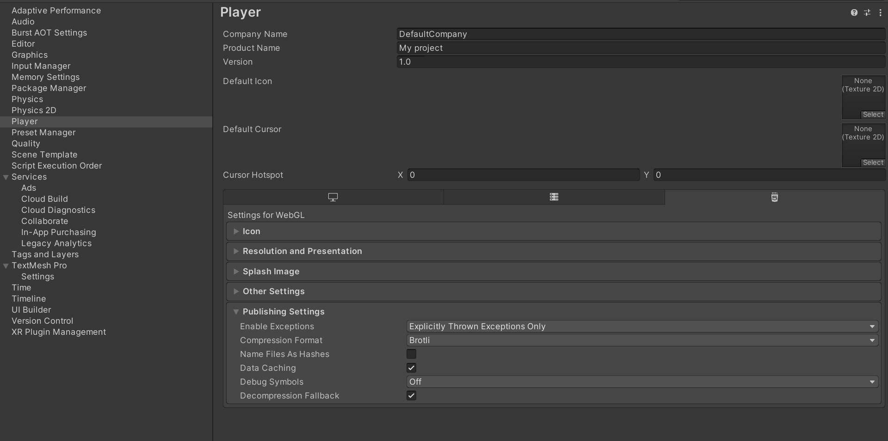

# Shhootout

## About the Game

Shhootout is a top-down stealth shooter, in which the user can play and create his own levels. The user can create an account which will be registered in the database alongside the levels they create. 

## About Us

Game development in itself is a form of art: the convergence of storytelling and engineering is most visible in the videogames we create and we play.

However, it seems that modern video game development is solely focused on profit than playability: rushing a new iteration without regards for its artistry.

Our mission with SHHOOTOUT, is to educate future videogame developers in game design: teaching them the consequences of their design choices - e.j. where to place a sandbag or where to place an enemy, in the fun and playability of their games.

This way, they can create games that not only are fun to play, but that will leave a legacy of respect for the user-developer relationship.


## Running the Project

### On the Web

The project is hosted on https://web.shhootout.tk

### Locally

The project is run on Flask. You will to meet the Python3 dependencies on `requirements.txt`.

After that you can run the project with,

``` export FLASK_APP=main ```
``` flask run ```


#### Building the Unity Game




#### Run the project using docker

You'll need docker-compose cli tool, for more information about how to install it: https://docs.docker.com/compose/install/

If you want to change the ssl certificate please refer to create a self signed certificate: https://devopscube.com/create-self-signed-certificates-openssl/


```docker-compose up --build```


## Video Demo

https://youtu.be/haypry2uUuM


Electronic Rats &copy; 2022
